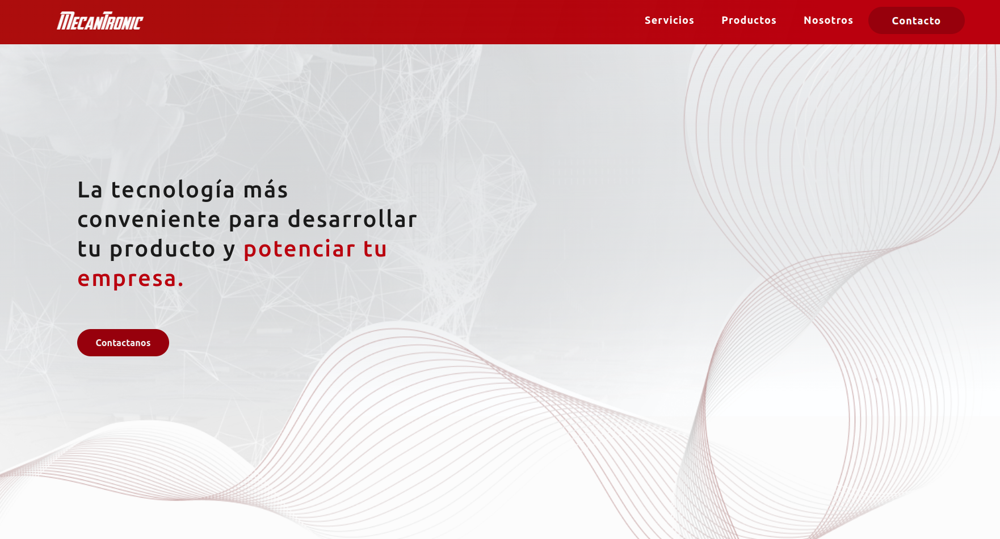

# Mecantronic - Landing page

Repositorio de la versión 2023 de [mecantronic.com.ar](https://mecantronic.com.ar/).



# 🚀 **Getting started**

## 🌱 **Developer mode**

1. Para poder levantar de forma local esta page, descargar el repositorio:
    ``` bash
    git clone https://github.com/githubmec/mecantronic-page.git
    cd mecantronic-page
    ```

2. Obtener Node.js (en linux):
    ``` bash
    sudo apt install npm 
    ```

3. Instalar las dependencias necesarias del proyecto.
    ``` bash
    npm i
    ```

4. Levantar la web-page de forma local.
    ``` bash
    npm start
    ```

5. Abre tu navegador y visita http://localhost:3000 para ver la landing page en funcionamiento.

### Contribución
Para contribuir a este proyecto, seguir estos pasos:

1. Clonar el repositorio.
2. Crear una rama desde la rama `develop` para tu contribución: `git checkout -b feature/nueva-funcionalidad`.
3. Hacer commit de los cambios: `git commit -m "Añadir nueva funcionalidad"` en caso de estar resolviendo un issue, agregar al commit el número de issue (Ej: #10).
4. Subir los cambios al repositorio remoto: `git push origin feature/nueva-funcionalidad`.
5. Crea un Pull Request (PR) a la rama `develop` en el repositorio remoto.

## 🚀 **Production mode**
Este proyecto implementa CI/CD, usando [Github Actions](https://github.com/features/actions) y [webhook](https://www.redhat.com/es/topics/automation/what-is-a-webhook). Para ver los cambios reflejados en la web hay que hacer un PR desde `develop` a `main` y ser autorizado por un integrante del proyecto.

> El despliegue automatizado esta definido en el archivo `/.github/workflows/deploy.yml` y se realiza sobre la rama `build`.

> La rama `build` contiene la versión optimizadapara desplegar en el servidor.

1. Clonar repositorio y posicionarse en la branch `develop`.

2. Agregar en el archivo `package.json`, el domínio de web.
    ``` bash
    "homepage": "https://mecantronic.com.ar/",
    ```
3. Crear un PR desde `develop` a `main`.

# Dominio

El dominio [mecantronic.com.ar](www.mecantronic.com.ar) fue adquirido en [nic.ar](https://nic.ar/es/ayuda/instructivos/registro-de-dominio). 

# Hosting
La web esta hosteada en [Hostinger](https://www.hostinger.com.ar/). Se implemento un webhook para sincronizar la rama `build` con el hosting.
